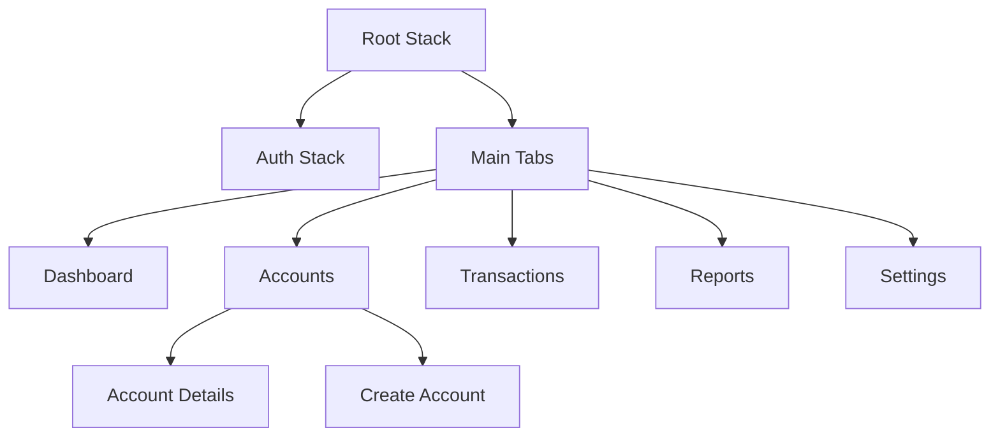
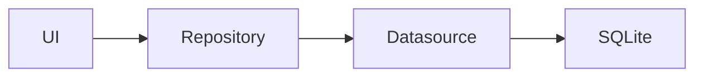
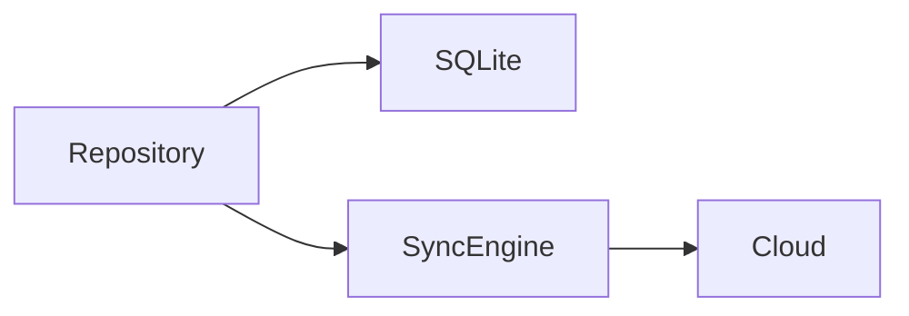

# Finance Platform Architecture

> Version: 1.0
> Status: Approved
> Scope: Mobile-first, Offline-first, India-first

## 1. Vision

Build a high-performance, offline-first personal finance platform for Indian users. The architecture must allow the application to function entirely without a backend initially while keeping cloud sync as an implementation detail that can be added later without changing the UI or business logic.

## 2. Core Principles

- Offline-first.
- Feature-first organization.
- Monorepo from day one.
- Keep architecture simple enough for one developer.
- Separate business logic from UI.
- Repository + Datasource pattern.
- Type-safe TypeScript.
- Test every feature.
- Prefer composition over inheritance.
- Extract shared packages only when used by at least two apps.

## 3. Tech Stack

| Area | Choice |
|---|---|
| Monorepo | Turborepo |
| Package Manager | pnpm |
| Mobile | React Native CLI |
| Language | TypeScript (strict) |
| Navigation | React Navigation |
| Client State | Zustand |
| Server State | TanStack Query |
| Database | SQLite |
| Storage | MMKV |
| Styling | Unistyles |
| Forms | React Hook Form |
| Validation | Zod |
| Charts | Victory Native XL |
| Icons | Lucide React Native |
| Testing | Vitest, React Native Testing Library, Detox |
| CI | GitHub Actions |

## 4. Repository Structure

```text
finance-platform/
├── apps/
│   └── mobile/
├── docs/
│   └── ARCHITECTURE.md
├── packages/
│   ├── eslint-config/
│   ├── types/
│   └── typescript-config/
├── turbo.json
├── pnpm-workspace.yaml
└── package.json
```

Future:

```text
apps/
├── mobile/
├── backend/
└── website/
```

## 5. Mobile Structure

```text
src/
├── app/
│   ├── navigation/
│   ├── providers/
│   ├── theme/          # Unistyles / preference wiring (not tokens)
│   └── bootstrap/
├── core/
│   ├── database/
│   ├── storage/
│   ├── logging/
│   ├── security/
│   ├── config/
│   └── utils/
├── shared/
│   ├── components/
│   ├── hooks/
│   ├── theme/          # Design tokens (color, spacing, typography, …)
│   ├── icons/
│   ├── charts/
│   ├── constants/
│   ├── forms/          # React Hook Form + Zod helpers
│   ├── types/
│   └── utils/
└── features/
    ├── authentication/
    ├── dashboard/
    ├── accounts/
    ├── transactions/
    ├── budgets/
    ├── goals/
    ├── investments/
    ├── subscriptions/
    ├── loans/
    ├── reports/
    └── settings/
```

> `app/theme` registers themes at runtime. `shared/theme` owns design tokens.
> `shared/forms`, `shared/types`, and `shared/utils` were added to match form/validation and cross-feature helper needs without premature package extraction.

## 6. Feature Structure

```text
accounts/
├── components/
├── screens/
├── hooks/
├── domain/
├── data/
│   ├── repositories/
│   ├── datasources/
│   └── models/
├── navigation/
├── validation/
├── types/
└── __tests__/
```

### Responsibilities

- screens: route-level UI
- components: reusable UI within the feature
- hooks: orchestration
- domain: business rules/entities
- repositories: expose business-friendly APIs
- datasources: SQLite today, cloud later
- validation: Zod schemas
- tests: unit/integration

## 7. Dependency Rules

```text
Screen
  ↓
Hook
  ↓
Repository
  ↓
Datasource
  ↓
SQLite
```

Rules:

- Screens never access SQLite.
- Hooks never execute SQL.
- Datasources never import UI.
- Shared must remain platform-agnostic where practical.
- Core must not depend on features.

## 8. Navigation



## 9. State Management

Use Zustand only for client state:

- theme
- auth status
- filters
- UI preferences

Use TanStack Query for future remote state.

Business data comes from repositories.

## 10. Local Data

SQLite is the source of truth.



Future:



## 11. Repository Pattern

Repositories expose domain operations, not SQL.

Example:

- createAccount()
- transferMoney()
- getNetWorth()

Never:

- selectFromAccounts()

## 12. Offline First

V1:

```text
UI → SQLite
```

V2:

```text
UI → SQLite → Sync
```

V3:

```text
UI → SQLite → Sync → Cloud
```

The UI is unchanged.

## 13. Authentication

Current:

- Local session abstraction.

Future:

- Supabase Auth
- Google
- Apple
- Phone OTP

Authentication is isolated behind an Auth service.

## 14. Performance

- FlashList for long lists.
- Lazy screen loading.
- Memoize expensive components.
- Paginate queries.
- Index SQLite tables.
- Avoid unnecessary re-renders.
- Keep animations at 60 FPS.

## 15. Security

- MMKV for secrets.
- SQLite for business data.
- Validate every input with Zod.
- No secrets in source code.
- Secure environment configuration.

## 16. Testing

- Unit tests for domain.
- Component tests for UI.
- Repository integration tests.
- End-to-end tests for critical flows.

CI blocks merges on failures.

## 17. CI

GitHub Actions:

- install
- typecheck
- lint
- test

Deployments added later.

## 18. Future Evolution

Phase 1:
- Offline app.

Phase 2:
- Supabase sync.

Phase 3:
- Background jobs.

Phase 4:
- Optional Go backend for advanced services.

## 19. ADR Summary

ADR-001: Monorepo.
ADR-002: React Native CLI.
ADR-003: TypeScript strict.
ADR-004: Feature-first architecture.
ADR-005: Repository + Datasource.
ADR-006: SQLite.
ADR-007: Zustand.
ADR-008: TanStack Query.
ADR-009: Offline-first.
ADR-010: Supabase before custom backend.
ADR-011: Go only when justified by business needs.

## 20. Architecture Rules

1. Features own their code.
2. No cross-feature imports except public APIs.
3. Extract shared code only after duplication.
4. Keep repositories backend-agnostic.
5. Cloud is optional.
6. SQLite is always available.
7. Optimize for simplicity.
8. Every architectural change requires updating this document.
